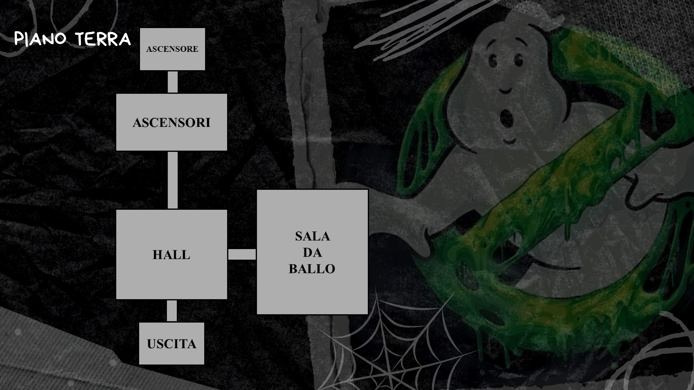
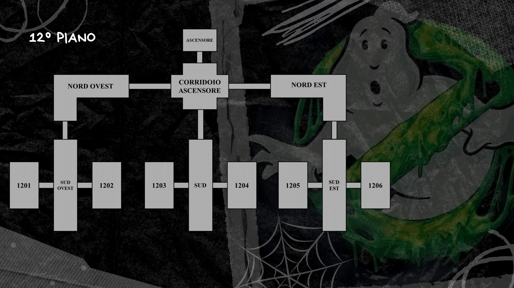
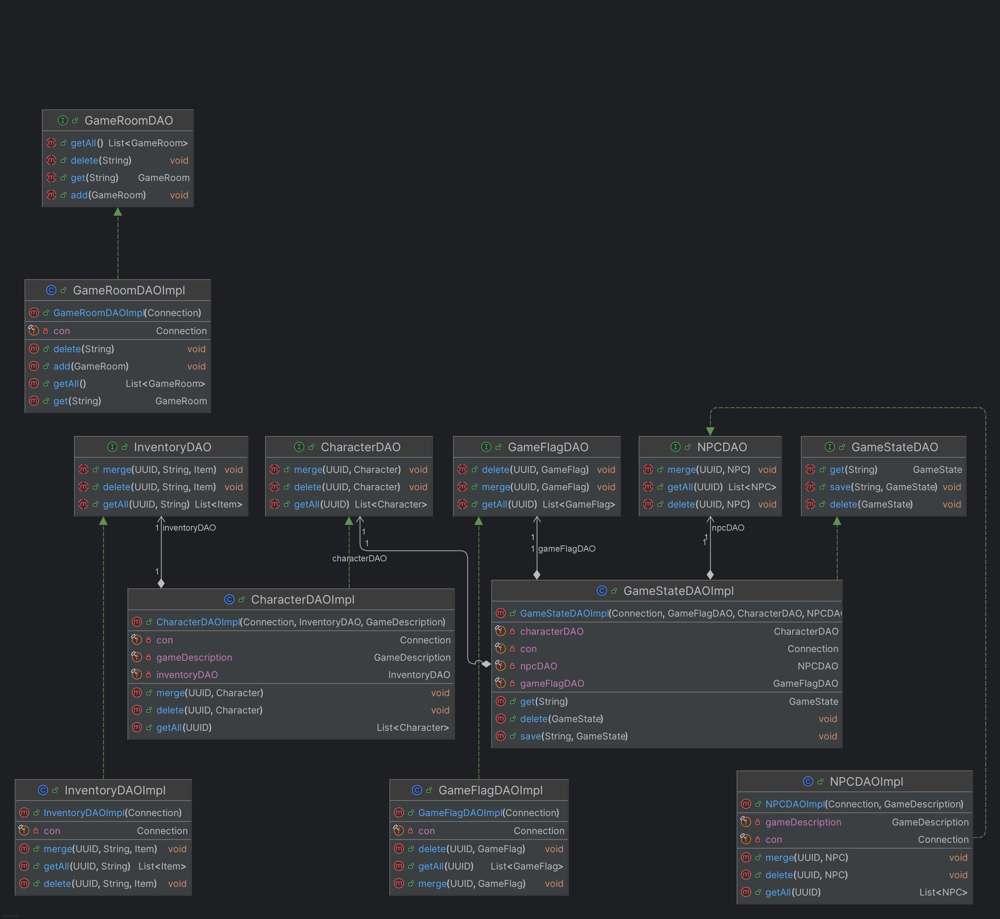
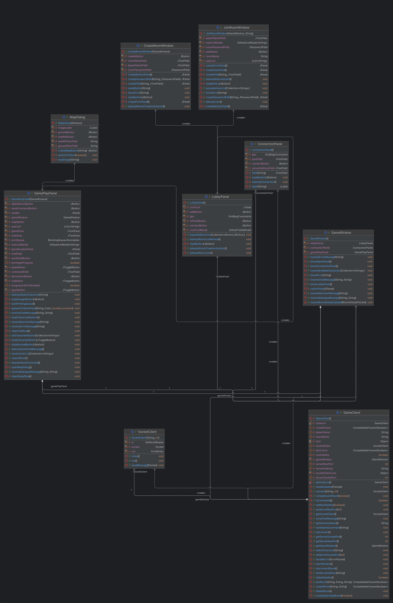
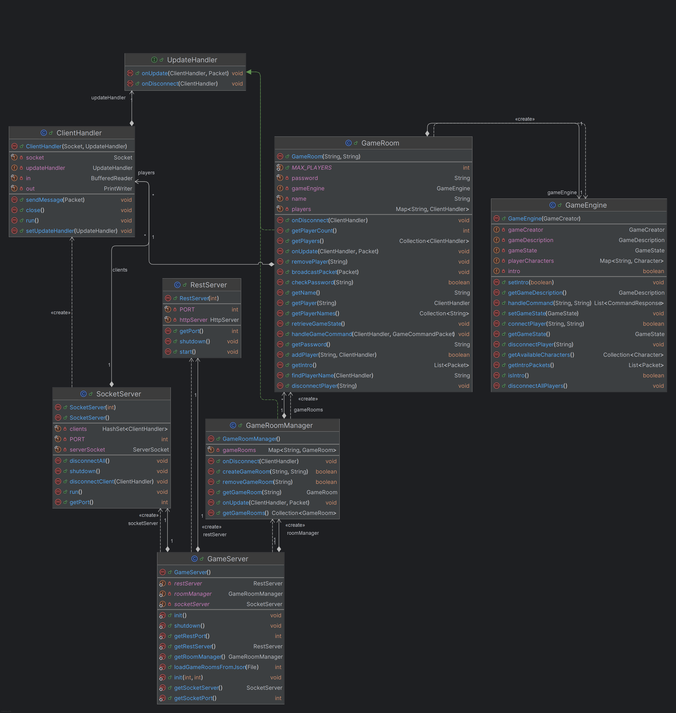
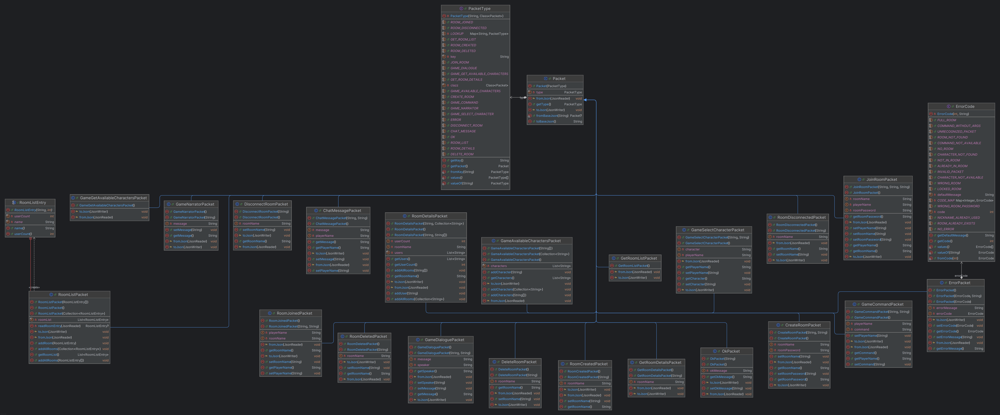

# Incubo al Sedgewick Hotel - Report

## Indice

### [Caratteristiche del progetto e del gioco](#Caratteristiche-del-progetto)
> #### [1. Introduzione generale](#Introduzione-generale)
> #### [2. Caratteristiche principali](#Caratteristiche-principali)
> #### [3. Trama del gioco](#Trama-del-gioco)

### [Utilizzo degli argomenti del corso](#Utilizzo-dei-vari-argomenti-del-corso)
> #### [1. OOP](#Progettazione-OOP)
> #### [2. Diagramma delle classi ](#Diagramma-delle-classi)
> #### [3. Specifica algebrica](#Specifica-algebrica)
> #### [4. File](#File)
> #### [5. Database](#Database)
> #### [6. Thread](#Thread)
> #### [7. REST e Socket](#REST-e-Socket)
> #### [8. GUI](#GUI)
> #### [9. Lambda expressions/functions](#Lambda-expressions-e-functions)

---

## Caratteristiche del progetto

In questa sezione spieghiamo meglio cos'è questo progetto, il suo scopo e alcuni approfondimenti sulla struttura del gioco.

---

### Introduzione generale

Questo progetto, intitolato *Incubo al Sedgewick Hotel*, è stato realizzato come prova finale per il corso di *Metodi Avanzati di Programmazione*, tenuto dal Prof. *Pierpaolo Basile* presso l'Università degli Studi di Bari Aldo Moro.

I membri del gruppo sono:
- *Aurora Pesare*
- *Gabriele Sanzione*
- *Massimo Ventura*

Il corso presenta come principale obiettivo l’approfondimento del paradigma della Programmazione ad Oggetti. Gli argomenti trattati sono stati messi in pratica attraverso la progettazione e lo sviluppo di un’applicazione software: un’avventura testuale.

Un’avventura testuale è un genere di videogioco in cui il giocatore interagisce con l’ambiente di gioco tramite l’inserimento di comandi testuali. Questo tipo di giochi ha avuto grande diffusione agli albori dell’informatica, quando le capacità grafiche dei sistemi erano ancora molto limitate.

---

### Caratteristiche principali

- **Interfaccia testuale**: l'interazione avviene tramite comandi scritti, come "vai a nord", "usa zaino protonico" o "guarda".
- **Descrizione degli ambienti**: il gioco presenta ambientazioni, oggetti e situazioni attraverso testi descrittivi piuttosto dettagliati, pensati per coinvolgere il giocatore e stimolarne l'immaginazione.
- **Esplorazione**: i giocatori sono chiamati a esplorare le diverse stanze e a utilizzare logica e intuito per progredire nell’avventura, interagendo con l’ambiente tramite comandi testuali e facendo uso degli oggetti raccolti lungo il percorso.

---

### Trama del gioco

*Incubo al Sedgewick Hotel* è un’avventura testuale ispirata al film *"Ghostbusters"*. L'avventura è ambientata in un elegante ma inquietante hotel di New York, dove qualcosa di anomalo ha iniziato a manifestarsi al dodicesimo piano. Nei panni dei membri dei Ghostbusters –  Peter Venkman, Raymond Stantz e Egon Spengler – il giocatore sarà chiamato a indagare su strani fenomeni paranormali che stanno turbando la quiete dell’edificio.

Attraverso l’esplorazione degli ambienti, l’interazione con personaggi secondari e l’uso strategico di oggetti e strumenti iconici, il giocatore dovrà raccogliere indizi e affrontare situazioni sempre più surreali.

Lo stile del gioco alterna momenti di tensione a battute ironiche e dialoghi brillanti, mantenendo il tono scanzonato tipico del franchise. Ogni scelta influenzerà il corso degli eventi, portando a diverse possibilità di approccio e risoluzione.

---

### Mappa del gioco




---

## Utilizzo dei vari argomenti del corso

In questa sezione vengono analizzati i principali concetti affrontati durante il corso e il modo in cui sono stati applicati all'interno del progetto. 

Per ciascun argomento verranno illustrati dei frammenti di codice tratti dal progetto, inseriti a scopo puramente esplicativo.

---

### Progettazione OOP

Questo progetto è stato sviluppato con l'intento di scrivere un codice quanto più **riutilizzabile** ed **estendibile** per il futuro. Sono stati applicati molti principi della **Programmazione a Oggetti** (OOP) tra cui **incapsulamento**, **ereditarietà** e **polimorfismo**.

Molte classi forniscono astrazioni generiche per i concetti fondamentali del dominio, mentre le specializzazioni vengono introdotte tramite ereditarietà o composizione.
* **`GameEngine`** (lato server) racchiude lo **stato globale** della partita e l'algoritmo di esecuzione dei comandi.
* **`EctoTextCreator`** implementa l'interfaccia `GameCreator` definendo **mappa**, **personaggi**, **comandi** e messaggi introduttivi dell'avventura *Incubo al Sedgewick Hotel*.
* **`GameClient`** (lato client) è l'unico punto di accesso alla rete e alla GUI; agisce come **Mediator** tra l'interfaccia grafica Swing e la connessione `SocketClient` garantendo una sola istanza (**Singleton**).
* L'estendibilità delle azioni del giocatore è ottenuta tramite la gerarchia di **`CommandHandler`**: ogni comando ("vai", "guarda", "usa" …) è incapsulato in una propria classe collocata nel package `common.model.impl.command`.

Con questa organizzazione modulare, aggiungere una **nuova avventura** richiede solo l'implementazione di un nuovo `GameCreator`; aggiungere un **nuovo comando** consiste nel creare una classe che implementa `CommandHandler` e nel registrarla nella mappa dei comandi. Tutti gli altri componenti (GUI, rete, persistenza) rimangono inalterati grazie al *principio di sostituibilità delle sottoclassi*.

Tra i **design pattern** adottati si evidenziano:
* **Singleton & Mediator** — `GameClient` centralizza la comunicazione e instrada pacchetti tra GUI e rete.
* **Factory Method** — `DAOFactory` e `PacketFactory` astraono la creazione di DAO e pacchetti di rete.
* **Template Method** — `GameEngine` stabilisce il flusso di elaborazione, demandando ai `CommandHandler` le operazioni concrete.
* **Builder Method** — `Room` contiene la inner class `RoomBuilder` che permette di creare delle stanze della mappa tramite la concatenazione di metodi.

Di seguito alcuni **estratti di codice** (troncati) rappresentativi dell'architettura di *EctoText*:

```java
// org.javamale.ectotext.server.util.DAOFactory
package org.javamale.ectotext.server.util;

import org.javamale.ectotext.common.model.GameDescription;
import org.javamale.ectotext.server.persistence.dao.CharacterDAO;
import org.javamale.ectotext.server.persistence.dao.GameFlagDAO;
import org.javamale.ectotext.server.persistence.dao.InventoryDAO;
import org.javamale.ectotext.server.persistence.dao.NPCDAO;
import org.javamale.ectotext.server.persistence.dao.impl.*;

import java.sql.Connection;

public class DAOFactory {
    public static GameStateDAOImpl createGameStateDAO(Connection connection, GameDescription gameDescription) {
        InventoryDAO inventoryDAO = new InventoryDAOImpl(connection);

        NPCDAO npcDAO = new NPCDAOImpl(connection, gameDescription);
        CharacterDAO characterDAO = new CharacterDAOImpl(connection, inventoryDAO, gameDescription);
        GameFlagDAO gameFlagDAO = new GameFlagDAOImpl(connection);

        return new GameStateDAOImpl(connection, gameFlagDAO, characterDAO, npcDAO);
    }
}
```

```java
// Corridoio Ascensore (12°)
        gameMap.addRoom(new Room.RoomBuilder("hallway_12_elevator")
                .setDisplayName("Corridoio Ascensore")
                .setDescription("Ti trovi nei corridoi del dodicesimo piano, vicino agli ascensori.")
                .setLongDescription("""
                    Ciò che resta del carrello della signora delle pulizie è un ammasso carbonizzato: qualcuno ha messo alla prova il raggio protonico qui. 
                    Le porte d’ottone degli ascensori scintillano ancora, in attesa.
                       . A NORD c'è l'Ascensore
                       . A SUD c'è il Corridoio Sud
                       . A EST c'è il Corridoio Nord Est
                       . A OVEST c'è il Corridoio Nord Ovest
                    """
                )
                .addLockedSouthRoom(gameMap.getRoom("hallway_12_s"), GameFlag.TUTORIAL_PROTON_BACKPACK_COMPLETE)
                .addLockedEastRoom(gameMap.getRoom("hallway_12_ne"), GameFlag.TUTORIAL_PROTON_BACKPACK_COMPLETE)
                .addLockedWestRoom(gameMap.getRoom("hallway_12_nw"), GameFlag.TUTORIAL_PROTON_BACKPACK_COMPLETE)
                .addLockedRoom("north", "12", gameMap.getRoom("elevator"), GameFlag.ELEVATOR_OPEN)
                .addHiddenItem(new Item("mocio", "Mocio", "Utile per pulire la sporcizia"),
                        GameFlag.TUTORIAL_PROTON_BACKPACK_COMPLETE
                        )
                .build()
        );
```

```java
public class GameClient {
    private static volatile GameClient instance;
    private static final Object lock = new Object();

    // ...
    
    private GameClient() {
        gameWindow = new GameWindow();
    }

    public static GameClient getInstance() {
        if (instance == null) {
            synchronized (lock) {
                if (instance == null) {
                    instance = new GameClient();
                }
            }
        }
        return instance;
    }

    // ...
}
```

Riportiamo qui anche il link alla documentazione completa **[Javadoc](https://whiteenderman14.github.io/ectotext-game/javadoc/)** del progetto.

---

### Diagramma delle classi

Qui sotto riportiamo i diagrammi delle classi delle porzioni principali del programma.

---



---



---



---


---



---

### Specifica Algebrica

Nel nostro progetto, abbiamo spesso fatto uso della struttura dati **Mappa**.

La mappa è una struttura dati che associa una chiave ad un valore, permettendo di memorizzare e recuperare informazioni in modo efficiente.

Ad esempio, è usata per associare il nome di una stanza ad una stanza vera e propria, oppure per associare i nickname ai client, o ancora per associare gli alias delle direzioni alle direzioni effettive. In questa sezione definiremo la specifica algebrica per questa struttura dati.

#### - Specifica sintattica

<table>
    <thead>
        <tr>
            <th colspan="2">Tipi</th>
        </tr>
    </thead>
    <tbody>
        <tr>
            <td colspan="2">Map, Key, Value, Boolean, Integer</td>
        </tr>
        <tr>
            <td colspan="2"><strong>Operatori</strong></td>
        </tr>
        <tr>
            <td><code>newMap() -> Map</code></td>
            <td>Crea una nuova mappa vuota</td>
        </tr>
        <tr>
            <td><code>isEmpty(Map) -> Boolean</code></td>
            <td>Restituisce <code>true</code> se la mappa è vuota, <code>false</code> altrimenti</td>
        </tr>
        <tr>
            <td><code>put(Map, Key, Value) -> Map</code></td>
            <td>Aggiunge una coppia chiave-valore alla mappa, o, se già presente, ne aggiorna il valore</td>
        </tr>
        <tr>
            <td><code>get(Map, Key) -> Value</code></td>
            <td>Restituisce il valore associato alla chiave specificata</td>
        </tr>
        <tr>
            <td><code>containsKey(Map, Key) -> Boolean</code></td>
            <td>Restituisce <code>true</code> se la chiave specificata è presente nella mappa</td>
        </tr> 
        <tr>
            <td><code>containsValue(Map, Value) -> Boolean</code></td>
            <td>Restituisce <code>true</code> se il valore specificato è presente nella mappa</td> 
        </tr>
        <tr>
            <td><code>remove(Map, Key) -> Map</code></td>
            <td>Rimuove la chiave ed il valore associato ad essa dalla mappa</td>
        </tr> 
        <tr>
            <td><code>size(map) -> Integer</code></td>
            <td>Restituisce il numero di coppie chiave-valore presenti nella mappa</td>  
        </tr>
    </tbody>
</table>

#### - Osservazioni e Costruttori


<table>
  <thead>
    <tr>
      <th></th>
      <th colspan="2">Costruttori di m'</th>
    </tr>
  </thead>
  <tbody align="center">
    <tr>
      <td><strong>Osservazioni</strong></td>
      <td><code>newMap</code></td>
      <td><code>put(m, k, v)</code></td>
    </tr>
    <tr>
      <td><code>isEmpty(m')</code></td>
      <td><code>true</code></td>
      <td><code>false</code></td>
    </tr>
    <tr>
      <td><code>containsKey(m', k')</code></td>
      <td><code>false</code></td>
      <td>if <code>k = k'</code> then <code>true</code> else <code>containsKey(m, k')</code></td>
    </tr>
    <tr>
      <td><code>containsValue(m', v')</code></td>
      <td><code>false</code></td>
      <td>if <code>v = v'</code> then <code>true</code> else <code>containsValue(m, v')</code></td>
    </tr>
    <tr>
      <td><code>get(m', k')</code></td>
      <td><code>error</code></td>
      <td>if <code>k = k'</code> then <code>v</code> else <code>get(m, k')</code></td>
    </tr>
    <tr>
      <td><code>remove(m', k')</code></td>
      <td><code>error</code></td>
      <td>if <code>k = k'</code> then <code>m</code> else <code>put(remove(m, k'), k, v)</code></td>
    </tr>
    <tr>
      <td><code>size(m')</code></td>
      <td><code>0</code></td>
      <td>if <code>containsKey(m, k)</code> then <code>size(m)</code> else <code>size(m) + 1</code></td>
    </tr>
  </tbody>
</table>

#### - Specifica semantica


- **DECLARE**
  - <code>m</code>, <code>m'</code>: <code>Map</code>
  - <code>k</code>, <code>k'</code>: <code>Key</code>
  - <code>v</code>, <code>v'</code>: <code>Value</code>

- **OPERATIONS**
  - <code>isEmpty(newMap)</code> = <code>true</code>
  - <code>isEmpty(put(m, k, v))</code> = <code>false</code>
  - <code>containsKey(newMap, k')</code> = <code>false</code>
  - <code>containsKey(put(m, k, v), k')</code> = if <code>k = k'</code> then <code>true</code> else <code>containsKey(m, k')</code>
  - <code>containsValue(newMap, v')</code> = <code>false</code>
  - <code>containsValue(put(m, k, v), v')</code> = if <code>v = v'</code> then <code>true</code> else <code>containsValue(m, v')</code>
  - <code>get(put(m, k, v), k')</code> = if <code>k = k'</code> then <code>v</code> else <code>get(m, k')</code>
  - <code>remove(put(m, k, v), k')</code> = if <code>k = k'</code> then <code>m</code> else <code>put(remove(m, k'), k, v)</code>
  - <code>size(newMap)</code> = <code>0</code>
  - <code>size(put(m, k, v))</code> = if <code>containsKey(m, k)</code> then <code>size(m)</code> else <code>size(m) + 1</code>


#### - Specifica di restrizione


- **RESTRICTIONS**
  - <code>get(newMap, k')</code> = <code>error</code>
  - <code>remove(newMap, k')</code> = <code>error</code>

---

## File

All'interno del progetto, i file vengono utilizzati per gestire alcune informazioni, in particolare per la configurazione del server e la gestione dinamica delle stanze di gioco. Questo approccio permette di mantenere una certa flessibilità e semplicità, soprattutto per operazioni che devono essere facilmente configurabili dagli amministratori del gioco.

---

### Tipi di File Gestiti

1. **File di configurazione (.properties)**
  - Viene utilizzato un file di configurazione in formato `properties` (es: `server.properties`) per la lettura delle impostazioni principali dell’applicazione lato server, come le porte dei servizi (socket e REST).

2. **File JSON per le stanze**
  - Il caricamento delle stanze da file viene effettuato tramite il metodo statico `GameServer.loadGameRoomsFromJson(File jsonFile)`, che esegue il parsing del file JSON e crea dinamicamente le stanze nella sessione server.
  - Questo permette di creare delle stanze iniziali all'avvio del server a partire da un file in formato `JSON` (es: `gamerooms.json`).

---

## Gestione dei File JSON

Per la gestione dei file JSON relativi alle stanze di gioco, è stato implementato il metodo:

```java
public static int loadGameRoomsFromJson(File jsonFile) throws IOException
```

- Questo metodo legge un array di oggetti dal file JSON, ciascuno rappresentante una stanza.
- Ogni oggetto può contenere i seguenti campi:
  - `room_name`: Nome della stanza
  - `room_password`: Password della stanza (opzionale)
- Per ogni stanza, viene invocato il metodo `createGameRoom` del `GameRoomManager` per registrarla nel sistema. Se una stanza esiste già, viene sollevata un’eccezione.
- Il metodo restituisce il numero di stanze caricate correttamente.

**Esempio di struttura del file `rooms.json`:**
```json
[
  { "room_name": "Pippo", "room_password": "" },
  { "room_name": "Topolino", "room_password": "ghosts" }
]
```

### Gestione dei File di Configurazione (`.properties`)

Il file di configurazione può essere passato tramite riga di comando al server. La classe `MainGame.ServerCommand` legge e applica le proprietà definite, in particolare:
- Porte del socket server e del server REST (`socket-port`, `rest-port`)
- Altre eventuali impostazioni future

Esempio di utilizzo:
```shell
java -jar IncuboSedgewickHotel.jar server -p server.properties
```

**Esempio di contenuto di un file `server.properties`:**
```
socket-port=7777
rest-port=9090
```

### Serializzazione/Deserializzazione e Avvio Server

- **Caricamento stanze:** Se viene passato un file JSON con le stanze (`-r, --rooms`), queste vengono caricate all’avvio del server tramite `GameServer.loadGameRoomsFromJson`.
- **Configurazione porte:** Se sono specificate le porte tramite file di properties o direttamente da linea di comando, vengono usate per avviare i servizi di rete.
- **Reset del DB:** È presente anche un’opzione (`--reset-db`) che consente di ripristinare lo stato del database (gestito da `DbManager`), separando così la gestione dati persistenti dalle configurazioni dinamiche via file.

### Estratto di Codice Rilevante

```java
// Lettura e parsing delle stanze dal file JSON
public static int loadGameRoomsFromJson(File jsonFile) throws IOException {
    int roomCount = 0;
    try (JsonReader reader = new JsonReader(new FileReader(jsonFile))) {
        reader.beginArray();
        while (reader.hasNext()) {
            String roomName = null;
            String roomPassword = null;

            reader.beginObject();
            while (reader.hasNext()) {
                String fieldName = reader.nextName();
                switch (fieldName) {
                    case "room_name" -> roomName = reader.nextString();
                    case "room_password" -> roomPassword = reader.nextString();
                    default -> reader.skipValue();
                }
            }
            reader.endObject();

            if(getRoomManager().createGameRoom(roomName, roomPassword)) {
                roomCount++;
            } else {
                throw new IOException("Room " + roomName + " already exists");
            }
        }
        reader.endArray();
    }
    return roomCount;
}
```

---

### Conclusioni

La gestione dei file in questo progetto è orientata a garantire la massima configurabilità e flessibilità per la creazione e modifica delle stanze e per la configurazione dei servizi server, lasciando la logica di gioco e la persistenza degli stati dinamici (come player e game progress) ad altri sistemi, come il database e le classi di gestione Java.

**N.B.** Vengono utilizzate anche delle immagini nell'interfaccia grafica del client.

---

## Database

Nel nostro programma abbiamo usato **H2**, un database open-source basato su SQL scritto in Java, che permette l'integrazione di un database SQL nelle applicazioni Java, sia in modalità server che in modalità embedded.

Il database viene utilizzato per la **persistenza dello stato delle partite multiplayer**, così che i giocatori possano disconnettersi e riconnettersi mantenendo i progressi. Vengono salvate le informazioni sulle stanze di gioco, gli stati di gioco (flag, personaggi, NPC e inventari) e la configurazione dei game room.

### Tabelle

Sono state definite le seguenti tabelle:

- `game_rooms` — memorizza il nome e la password delle stanze di gioco.
- `game_states` — memorizza lo stato di una partita associata a una stanza.
- `game_flags` — memorizza i flag di gioco attivi per uno stato.
- `characters` — memorizza i personaggi giocanti e la loro posizione.
- `npcs` — memorizza gli NPC e la loro posizione.
- `character_inventories` — memorizza gli oggetti posseduti da ciascun personaggio.

Le tabelle sono create all’avvio tramite la classe `DbManager`, che esegue uno script SQL per creare le tabelle se non esistono. Tutte le relazioni sono vincolate tramite **foreign key** per mantenere la coerenza.

### Connessione al Database


Per gestire la connessione al database abbiamo implementato la classe singleton `DbManager`, che fornisce un’unica istanza della connessione condivisa in tutto il programma. La configurazione (URL del database, utente, password) è definita nella stessa classe e sfrutta JDBC tramite `DriverManager`.

Esempio per ottenere una connessione:

```java
Connection con = DbManager.getConnection();
```

Esempio per creare le tabelle:

```java
DbManager.getInstance().setupDatabase();
```

### Setup e Popolamento


Non è previsto popolamento con dati iniziali: le tabelle vengono create vuote e riempite dinamicamente in base alle azioni dei giocatori. Tuttavia, la struttura completa è garantita all’avvio grazie a `DbManager`.

### Pattern DAO


Nel nostro progetto, abbiamo applicato il pattern architetturale **DAO (Data Access Object)**, che isola la logica di accesso ai dati dal resto dell’applicazione. Per ogni tabella definita nel database è stata creata:

- un’interfaccia DAO che dichiara i metodi di accesso.
- una classe *Record/Model* già presente nei moduli comuni.
- un’implementazione DAO che realizza le operazioni dichiarate.

### DAO implementati


| Tabella               | Interfaccia         | Implementazione      |
|------------------------|----------------------|-----------------------|
| `characters`           | `CharacterDAO`      | `CharacterDAOImpl`   |
| `game_flags`           | `GameFlagDAO`       | `GameFlagDAOImpl`    |
| `game_rooms`           | `GameRoomDAO`       | `GameRoomDAOImpl`    |
| `game_states`          | `GameStateDAO`      | `GameStateDAOImpl`   |
| `character_inventories`| `InventoryDAO`      | `InventoryDAOImpl`   |
| `npcs`                 | `NPCDAO`            | `NPCDAOImpl`         |

Queste classi forniscono operazioni CRUD per ogni entità.

### Esempi di utilizzo delle DAO


Creazione di una nuova stanza:
```java
GameRoomDAO gameRoomDAO = new GameRoomDAOImpl(DbManager.getConnection());
GameRoom newRoom = new GameRoom("Stanza1", "password123");
gameRoomDAO.add(newRoom);
```

Caricamento di tutte le stanze:
```java
List<GameRoom> rooms = gameRoomDAO.getAll();
for (GameRoom room : rooms) {
    System.out.println(room.getName());
}
```

Salvataggio dello stato di gioco completo:
```java
GameStateDAO gameStateDAO = new GameStateDAOImpl(
    DbManager.getConnection(),
    new GameFlagDAOImpl(con),
    new CharacterDAOImpl(con, new InventoryDAOImpl(con), gameDescription),
    new NPCDAOImpl(con, gameDescription)
);
gameStateDAO.save("Stanza1", gameState);
```

Caricamento dello stato di una stanza:
```java
GameState savedState = gameStateDAO.get("Stanza1");
if (savedState != null) {
    System.out.println("Stato recuperato con UUID: " + savedState.getUuid());
}
```

Gestione inventario di un personaggio:
```java
InventoryDAO inventoryDAO = new InventoryDAOImpl(DbManager.getConnection());
UUID gameStateID = gameState.getUuid();
String characterName = "Player1";

List<Item> items = inventoryDAO.getAll(gameStateID, characterName);
for (Item item : items) {
    System.out.println(item.getDisplayName());
}
```

Eliminazione di un NPC:
```java
NPCDAO npcDAO = new NPCDAOImpl(DbManager.getConnection(), gameDescription);
npcDAO.delete(gameState.getUuid(), npc);
```

### Utilizzo nella logica del gioco


#### - Salvataggio e recupero dello stato


Quando una stanza viene caricata dal database (`GameRoom`), questa chiama subito `GameRoom.retrieveGameState()` per caricare lo stato della partita dal database, se esiste.
Successivamente, durante la partita, **ad ogni comando di gioco eseguito da un giocatore**, lo stato aggiornato viene immediatamente salvato nel database tramite `GameStateDAO.save()` per garantire persistenza e consistenza.

**Esempio: recupero dello stato all’avvio del server**
```java
gameRoom.retrieveGameState();
```

**Esempio: salvataggio dello stato dopo un comando**
```java
gameStateDAO.save(gameRoom.getName(), gameEngine.getGameState());
```

#### - Gestione delle stanze


La gestione delle stanze (`GameRoomManager`) si appoggia a `GameRoomDAO` per salvare e caricare le informazioni sulle stanze all’avvio.

Esempio:
```java
boolean created = gameRoomManager.createGameRoom("Stanza2", "pwd456");
if (created) {
    System.out.println("Stanza creata con successo!");
}
```

---

### Conclusioni


Abbiamo scelto H2 per la sua leggerezza e integrazione embedded. Il pattern DAO ci ha permesso di mantenere un buon livello di astrazione e separazione dei livelli logici, facilitando manutenzione ed estensibilità futura. La gestione delle transazioni è implementata con `setAutoCommit(false)` e `rollback` in caso di errori.

Le query SQL utilizzano la sintassi `MERGE INTO` per garantire inserimento o aggiornamento atomico.

---

## Thread

L’architettura di *EctoText* è stata pensata per rimanere reattiva anche quando il carico
di lavoro aumenta: la GUI non deve mai bloccarsi, i messaggi di chat devono arrivare
immediatamente e il server deve gestire più giocatori contemporaneamente.  
Per raggiungere questo obiettivo il progetto impiega diversi strumenti di
**concorrenza** offerti da Java: thread dedicati, l’Event‑Dispatch Thread di Swing e le
`CompletableFuture` per gestire risposte asincrone.

---

### Il lato server: un thread per ascoltare, tanti thread per i client

All’avvio il server crea un’istanza di `SocketServer`, che **estende `Thread`**.
Il suo compito è semplice ma critico: rimanere in ascolto (`accept()`) su una porta
e, appena un client si connette, creare un nuovo **`ClientHandler`** e
lanciarlo con `start()`.  
Ogni client vive quindi in un **thread indipendente**; se un giocatore invia un comando
molto pesante, gli altri non ne risentono.

Esempio esplicativo, non precisamente tratto dal codice:

```java
public class SocketServer extends Thread {
    public void run() {
        while (!interrupted()) {
            Socket socket = serverSocket.accept();
            ClientHandler ch = new ClientHandler(socket, roomManager);
            ch.start();                                // nuovo thread per il client
        }
    }
}
```

`ClientHandler` a sua volta esegue un loop di lettura su `BufferedReader` e,
per ogni pacchetto JSON ricevuto, lo deserializza e lo passa alla logica di gioco.
Una piccola ma importante accortezza: le scritture sullo stream di uscita avvengono
dentro un blocco `synchronized (out)` così da evitare che due thread
scrivano contemporaneamente sulla stessa connessione.

---

### Il lato client: ascolto in background e future per la GUI

Sul client la stessa idea si ripete:
`SocketClient` **estende direttamente `Thread`**. In questo modo incapsula tutta la
logica di ascolto all’interno del proprio metodo `run()`; la GUI, quindi, deve solo
chiamare `socketClient.start()` e non si preoccupa più dei dettagli.

```java
public class SocketClient extends Thread {
    public void run() {
        try {
            while (!Thread.currentThread().isInterrupted()) {
                String json = in.readLine();                 // bloccante
                if (json == null) {                          // server chiuso
                    GameClient.getInstance().disconnect();
                    break;
                }
                Packet pkt = Packet.fromBaseJson(json);
                GameClient.getInstance().handleUpdate(pkt);  // delega alla logica
            }
        } finally {
            socket.close();
        }
    }
}
```

Grazie a questo design il **thread di rete** rimane indipendente e la finestra Swing
continua a rispondere ai clic dell’utente.

---

### CompletableFuture per integrare la logica asincrona con la GUI

Operazioni come *creare* o *entrare* in una stanza potrebbero richiedere diversi round‑trip
verso il server. Per evitare finestre congelate, `GameClient` restituisce un
`CompletableFuture<Boolean>` quando la GUI chiede, ad esempio, di creare una stanza:

```java
public CompletableFuture<Boolean> createRoom(String room, String pwd) {
    createFuture = new CompletableFuture<>();
    socketClient.sendMessage(new CreateRoomPacket(room, pwd));
    return createFuture;             // la GUI vi si aggancia
}
```

Quando arriva la risposta dal server, `GameClient` completa la future:

```java
public void completeCreateRoom(boolean success) {
    if (createFuture != null) {
        createFuture.complete(success); // risveglia eventuali thenApply() in GUI
    }
}
```

Il risultato è un flusso totalmente asincrono: la GUI non viene bloccata
finché la `CompletableFuture` non viene risolta.

---

### Swing e l’Event‑Dispatch Thread

Tutte le operazioni che toccano i componenti Swing sono incanalate
nell’**Event‑Dispatch Thread** attraverso `SwingUtilities.invokeLater()`.
Esempio tratto da `LobbyPanel`:

```java
SwingUtilities.invokeLater(() -> populateRoomList(rooms));
```

Così si evita la temuta eccezione *“Not on the EDT”* e, soprattutto,
si garantisce che più thread (network, timer, future) non accedano
alla GUI contemporaneamente.

---

### Sincronizzazione e gestione risorse

| Situazione                   | Meccanismo usato                                 |
|------------------------------|--------------------------------------------------|
| Scrittura concorrente su socket (`PrintWriter`) | blocco `synchronized (out)` |
| Collezione condivisa di client sul server       | blocchi `synchronized (clients)` |
| Chiusura socket in qualsiasi circostanza        | try‑with‑resources o `finally` |
| Callback asincrone verso la GUI                 | `SwingUtilities.invokeLater` + `CompletableFuture` |

Queste tecniche minimizzano il rischio di **race condition** e garantiscono
la chiusura corretta delle risorse anche se un thread viene terminato
in modo anomalo.

---

### Conclusioni

Grazie all’architettura multithread:

- il server scala linearmente col numero di giocatori;
- la chat e i comandi appaiono in tempo reale;
- la GUI rimane sempre reattiva;  
- le finestre di dialogo si chiudono appena
  `CompletableFuture` viene completato;

In conclusione, *EctoText* combina thread tradizionali, Swing‑EDT e
`CompletableFuture` per orchestrare una concorrenza semplice ma efficace,
garantendo allo stesso tempo performance e manutenibilità del codice.

---

## REST e Socket

La comunicazione tra client e server di *EctoText* è stata progettata su **due canali distinti**, ognuno scelto in base al tipo di informazione che deve viaggiare:

1. **HTTP REST** – leggero, stateless, ideale per interrogazioni “una tantum” come la verifica che il server sia vivo, la richiesta dell’elenco delle stanze disponibili o del numero di porta su cui ascolta il canale in tempo reale.  
2. **Socket TCP** – persistente e full-duplex, indispensabile per il flusso continuo di pacchetti di gioco (chat, comandi, aggiornamenti in tempo reale).

---

### Il micro-server REST: Jersey + Grizzly

#### 1.1 Avvio

La classe `GameServer.init()` avvia:

```java
roomManager = new GameRoomManager();
socketServer = new SocketServer(6666);
socketServer.start();
restServer   = new RestServer(8080);
restServer.start();
```

`RestServer` incapsula Jersey/Grizzly: registra le risorse e chiama `GrizzlyHttpServerFactory.createHttpServer(...)`. Il server HTTP resta in ascolto sulla porta 8080 (di default, ma si può impostare all'avvio) per tutta la vita del gioco.

#### 1.2 Endpoint esposti

| Servizio | Path | Metodo | Scopo |
|----------|------|--------|-------|
| `HealthService` | `/api/health` | GET | `{"status":"UP"}` per il ping del client |
| `SocketService` | `/api/socket/port` | GET | Consegna la porta del canale Socket |
| `GameRoomService` | `/api/rooms` | GET | Elenco stanze attive |
|  | `/api/rooms/{room}` | GET | Dettaglio di una stanza |
|  | `/api/rooms` | POST | Creazione stanza |

#### 1.3 Il client REST

La classe `RestAccess` usa il client JAX‑RS. Di seguito, un esempio:

```java
Client webClient  = ClientBuilder.newClient();
WebTarget target  = webClient.target("http://" + host + ":8080/api/health");
String statusJson = target.request().get(String.class);
```

La GUI chiama:

* `isHealthy()` prima di mostrare la lobby  
* `retrieveRoomList()` ad ogni refresh dell’elenco stanze  

Tutto gira in thread ausiliari per non bloccare l’EDT.

---

### Il canale Socket: tempo reale e pacchetti JSON

#### 2.1 Server

`SocketServer` estende `Thread`; nel suo `run()` esegue `accept()` in loop, creando un `ClientHandler` (anch’esso `Thread`) per ogni connessione:

```java
while (!isInterrupted()) {
    Socket sock = serverSocket.accept();
    new ClientHandler(sock, roomManager).start();
}
```

#### 2.2 Protocollo

Ogni pacchetto è una **singola riga JSON**.  `ClientHandler` legge con `readLine()`, deserializza con `Packet.fromBaseJson()` e inoltra al `UpdateHandler` corrispondente (può essere un GameRoom oppure GameRoomManager).

Scritture sullo stream di uscita sono sempre sincronizzate:

```java
synchronized (out) {
    out.println(packet.toBaseJson());
}
```

#### 2.3 Client

Sul versante utente entriamo nel cuore pulsante della comunicazione realtime.  
`SocketClient` non solo apre la connessione e la mantiene viva: nel suo `run()`.

```java
public void run() {
    try {
        while (!Thread.currentThread().isInterrupted()) {
            String json = in.readLine();      // 1️⃣ riceve la riga JSON
            if (json == null) { disconnect(); break; }

            Packet pkt = Packet.fromBaseJson(json);  // 2️⃣ deserializza
            GameClient.getInstance().handleUpdate(pkt); // 3️⃣ inoltra
        }
    } finally {
        socket.close();                         // chiusura sicura
    }
}
```

**Pipeline in tre passi**

1. **Ricezione** – ogni pacchetto del server è terminato da `\n`; `readLine()` è quindi
   sufficiente a ricostruire il messaggio completo senza buffering manuale.
2. **Deserializzazione** – `Packet.fromBaseJson(json)` è un factory che,
   leggendo il campo `type`, istanzia la sotto‑classe corretta
   (`RoomDetailsPacket`, `ErrorPacket`, `ChatMessagePacket`, ecc.).
3. **Smistamento** – la regia passa a `GameClient.handleUpdate(Packet)`.

#### Dentro `GameClient.handleUpdate`

```java
public void handleUpdate(Packet packet) {
    switch (packet) {
        case ChatMessagePacket chatMessagePacket   -> //... gestisce CHAT_MESSAGE
        ...
        case  RoomCreatedPacket ignored            -> completeCreateRoom(true);
        case RoomJoinedPacket roomJoinedPacket     -> completeJoinRoom(true);
        ...
        case ErrorPacket errorPacket               -> //... gestisce ERROR
        default                                    -> //... "Pacchetto non riconosciuto"
    }
}
```

* I metodi `completeCreateRoom/completeJoinRoom` **risolvono** le `CompletableFuture`
  che la GUI aveva ottenuto in fase di richiesta: in questo modo finestre modali vengono chiuse non appena l’operazione è confermata dal server.
* Ogni operazione che tocca Swing è avvolta in
  `SwingUtilities.invokeLater(...)` per garantire thread‑safety: la ricezione avviene
  infatti sul thread di `SocketClient`, non sull’EDT.

#### Invio pacchetti

La stessa classe offre un metodo thread‑safe per trasmettere verso il server:

```java
public void sendMessage(Packet packet) {
    synchronized (out) {                 // evita corruzioni se due thread inviano
        out.println(packet.toBaseJson()); // JSON + newline
    }
}
```

Le chiamate provengono tipicamente da azioni utente (pulsanti, comandi testuali)
che vivono sull’EDT: il lock impedisce che l’output venga intercalato con quello di
eventuali thread ausiliari.

In breve, **SocketClient → GameClient → GUI** costituisce una catena fluida in cui
ogni pacchetto trova il proprio destinatario, mentre la concorrenza è domata con
piccole, mirate sincronizzazioni e con il ricorso alle `CompletableFuture` per
dialogare in modo naturale con l’interfaccia Swing.

La GUI chiama semplicemente `socketClient.start()`.

### Logging ed error handling

* Eccezioni di rete loggate su `System.err` (server) o mostrate in finestra (client).  
* In caso di problemi applicativi il server invia un `ErrorPacket`; il client intercetta e eventualmente conclude la future con `false`.

---

### Conclusioni

* **REST** per operazioni “one‑shot” e discovery.  
* **Socket** per traffico continuo di gioco. 
* Sincronizzazione minima (`synchronized` sui writer, accesso alla lista client) per evitare race condition.

Il risultato è un sistema in cui i servizi HTTP forniscono la “rubrica” del server, mentre la linea Socket mantiene viva l’azione in tempo reale di *EctoText*.

---

## GUI

La GUI del client di gioco **Ghost Buster** è realizzata con Java, utilizzando i package **Swing** e **AWT**. L’interfaccia si compone di diverse finestre e pannelli che guidano il giocatore attraverso tutte le fasi del gioco: dalla connessione al server, alla scelta della stanza, fino all’esperienza di gioco vera e propria. Ogni sezione della GUI è progettata per essere facilmente navigabile, estendibile e coerente nello stile grafico, garantendo all’utente un’esperienza fluida e moderna.

---

### Struttura generale

Il cuore della GUI è rappresentato dalla classe `GameWindow`, una sottoclasse di `JFrame` che funge da contenitore principale per tutti i pannelli e dialog delle diverse fasi dell’applicazione. In fase di avvio, viene presentata la schermata di connessione (`ConnectionPanel`), da cui l’utente può proseguire verso la lobby delle stanze (`LobbyPanel`) e successivamente alla schermata di gioco (`GamePlayPanel`).

---

### Gestione dei pannelli

La classe `GameWindow` incapsula i tre principali pannelli:

```java
private final ConnectionPanel connectionPanel;
private final LobbyPanel lobbyPanel;
private final GamePlayPanel gamePlayPanel;
```

La transizione tra un pannello e l’altro avviene tramite il metodo `switchPanel(JPanel panel)`, che rimuove il contenuto corrente dal frame e aggiunge quello nuovo, aggiornando il titolo della finestra secondo la fase attuale. Ad esempio:

```java
public void showLobbyPanel() {
    switchPanel(lobbyPanel);
    setTitle("Ghost Buster - Lobby");
    lobbyPanel.attemptRoomListRefresh();
}
```

Questa struttura permette una chiara separazione delle responsabilità e una facile manutenzione del codice.

---

### Fase 1: Connessione al server

La prima schermata, realizzata nella classe `ConnectionPanel`, permette all’utente di inserire l’indirizzo del server e la porta su cui connettersi. L’aspetto grafico è curato tramite un `GridBagLayout`, sfondo scuro, font monospaziato per il titolo e pulsante “Connetti” in rosso scuro:

```java
JLabel title = new JLabel("👻 GHOST BUSTER - Connessione");
title.setFont(new Font("Monospaced", Font.BOLD, 22));
title.setForeground(Color.RED);

connectButton = new JButton("Connetti");
styleButton(connectButton); // rosso scuro, testo bianco
```

Quando l’utente preme il pulsante di connessione, viene avviato un thread che effettua la richiesta al server in modo asincrono, garantendo la responsività della GUI. Se la connessione ha successo, il gioco prosegue mostrando la lobby.

---

### Fase 2: Lobby delle stanze

Dopo la connessione, l’utente accede alla lobby, gestita dalla classe `LobbyPanel`. Qui viene mostrata una tabella delle stanze disponibili, con nome e numero di giocatori:

```java
roomListModel = new DefaultTableModel(new String[]{"Nome", "Giocatori"}, 0) { ... };
roomList = new JTable(roomListModel);
```

I pulsanti di interazione seguono un design coerente, in particolare:

- **Aggiorna**: aggiorna la lista delle stanze dal server, tramite chiamata REST asincrona.
- **Crea**: apre la finestra di creazione stanza.
- **Entra**: permette di selezionare una stanza ed accedere al join dialog.

Tutti i pulsanti sono stilizzati con sfondo rosso scuro e testo bianco:

```java
b.setBackground(new Color(80, 0, 0));
b.setForeground(Color.WHITE);
b.setFont(new Font("SansSerif", Font.BOLD, 14));
```

Esempio di popolamento della tabella:

```java
public void populateRoomList(Collection<RoomListPacket.RoomListEntry> rooms) {
    roomListModel.setRowCount(0);
    for (var e : rooms) {
        String label = String.format("%s", e.name());
        String players = String.format("%d/3", e.userCount());
        roomListModel.addRow(new Object[]{label, players});
    }
}
```

---

### Fase 3: Creazione e accesso alle stanze

Le finestre di creazione (`CreateRoomDialog`) e accesso (`JoinRoomDialog`) alle stanze sono entrambe realizzate come `JDialog` modali, con aspetto dark, layout a colonne, e campi per nome giocatore, nome stanza e password (con possibilità di mostrare/nascondere la password tramite toggle).

**Esempio di campo con toggle password:**

```java
JToggleButton toggle = new JToggleButton("👁️");
toggle.addActionListener(e -> field.setEchoChar(toggle.isSelected() ? (char) 0 : '•'));
```

La logica di creazione e join utilizza thread separati, con feedback immediato sullo stato del pulsante e messaggi d’errore in caso di problemi di connessione:

```java
createButton.setEnabled(false);
createButton.setText("Creazione...");
// Thread che gestisce la richiesta asincrona di creazione/join
```

Durante il join a una stanza, viene anche visualizzata la lista aggiornata dei giocatori presenti:

```java
userListModel.clear();
userListModel.addAll(users);
```

---

### Fase 4: Schermata di gioco

La schermata di gioco, realizzata dalla classe `GamePlayPanel`, offre una ricca interfaccia suddivisa in tre aree:

#### Barra superiore

Contiene i pulsanti di selezione personaggio (Peter, Ray, Egon), il pulsante per la mappa e i pulsanti di disconnessione e cancellazione stanza. Tutti i pulsanti hanno colori coerenti con il tema dark e feedback immediato.

```java
peterButton = new JToggleButton("Peter");
styleCharacterButton(peterButton); // blu scuro, testo bianco
```

#### Area centrale

Qui l’utente vede i messaggi di gioco tramite una `JTextPane` che supporta anche l’effetto “macchina da scrivere”:

```java
private void appendToGamePane(String text, Color color, boolean bold, boolean italic) {
    // Stampa progressiva carattere per carattere
}
```

I messaggi del narratore, dialoghi tra personaggi, errori e comandi sono realizzati in modo da essere visibili chiaramente.

Sotto la finestra principale è presente un campo per l’inserimento dei comandi di gioco, con un pulsante di invio.

#### Area laterale destra

Comprende la lista dei giocatori connessi alla stanza e una chat testuale tra utenti, completa di area testo e campo di input:

```java
userList = new JList<>(userListModel);
chatArea = new JTextArea();
sendChatButton = new JButton("Chat");
```

---

### Mappa interattiva

L’utente può accedere in ogni momento alla mappa di gioco tramite il pulsante dedicato, che apre il `MapDialog`. Questa finestra modale permette di visualizzare le mappe del piano terra e del dodicesimo piano, con i pulsanti che permettono lo switch tra i due livelli:

```java
groundButton = createMapButton("Piano Terra");
twelfthButton = createMapButton("12° Piano");
```

Le immagini vengono ridimensionate dinamicamente a seconda della dimensione della finestra:

```java
ImageIcon icon = new ImageIcon(getClass().getClassLoader().getResource(path));
Image scaled = img.getScaledInstance(newW, newH, Image.SCALE_SMOOTH);
imageLabel.setIcon(new ImageIcon(scaled));
```

---

### Scelte di stile e UX

La GUI mantiene uno stile coerente, con predominanza di grigio scuro e rosso scuro, pulsanti con font bold e testo bianco, e senza effetti di focus per evitare distrazioni. Tutte le azioni che possono bloccare l’interfaccia, come richieste al server, vengono gestite tramite thread separati, garantendo sempre la reattività del programma.

Inoltre, tutte le schermate e finestre mostrano messaggi di errore tramite `JOptionPane` per facilitare il debugging e l’usabilità da parte dell’utente finale.

---

### Come funziona la musica?

La musica è gestita in modo **centralizzato** dalla classe `GameWindow`, che si occupa di:
- Caricare e riprodurre una traccia (`Ghostbusters.wav`) in loop.
- Consentire di mettere in pausa o riprendere la musica da qualsiasi schermata.
- Mantenere sincronizzato lo stato della musica su tutta l’interfaccia grafica.

In pratica, ovunque ti trovi nel gioco, troverai una **grossa icona/emoji** della musica (`🔊` oppure `🔇`): cliccandola, la musica parte o si interrompe in tempo reale.

### Come viene implementato nel codice

#### Centralizzazione

La logica della musica è racchiusa in `GameWindow`:
- Usa la libreria Java Sound (`Clip`, `AudioInputStream`).
- Fornisce i metodi:
  - `playBackgroundMusic()`
  - `stopBackgroundMusic()`
  - `toggleMusic()`
  - `getMusicPlaying()`
- Quando lo stato cambia, **notifica tutti i pannelli** grafici tramite un metodo `updateMusicStatus()`.

#### Nei pannelli grafici

Ogni pannello importante (`ConnectionPanel`, `LobbyPanel`, `GamePlayPanel`...) ha una variabile:
```java
private final JLabel musicStatusLabel;
```
e la inizializza con un’icona grande.

Al click sull’icona:
```java
musicStatusLabel.addMouseListener(new java.awt.event.MouseAdapter() {
    public void mouseClicked(java.awt.event.MouseEvent e) {
        gameWindow.toggleMusic();
        updateMusicStatus();
    }
});
```
Il metodo `updateMusicStatus()` aggiorna l’emoji a seconda che la musica sia attiva o no:
```java
public void updateMusicStatus() {
    if (gameWindow.getMusicPlaying()) {
        musicStatusLabel.setText("🔊");
    } else {
        musicStatusLabel.setText("🔇");
    }
}
```
**Tutto il resto (caricamento, loop, stop) è gestito solo da `GameWindow`.**

---

### Vantaggi di questo approccio

- **Coerenza:** L’utente ha la stessa esperienza ovunque.
- **Facilità di manutenzione:** Se cambi la gestione della musica, basta modificare `GameWindow`.
- **Nessun doppione di codice audio:** Tutto passa sempre dal controller centrale.

---

### Conclusioni

La progettazione modulare e la separazione delle responsabilità permettono di estendere e mantenere facilmente l’interfaccia grafica. Ogni schermata è gestita da una classe dedicata e la navigazione tra le fasi del gioco è garantita da semplici chiamate ai metodi del frame principale, rendendo l’architettura facilmente scalabile.

---

## Lambda expressions e functions

### Listener Swing

```java
// ConnectionPanel – click su “Connetti”
connectButton.addActionListener(e -> attemptConnection());

// GamePlayPanel – selezione del personaggio
peterButton.addActionListener(e -> attemptSelectCharacter("peter"));
rayButton.addActionListener(e -> attemptSelectCharacter("ray"));
egonButton.addActionListener(e -> attemptSelectCharacter("egon"));

// MapDialog – tasto “Switch” per cambiare piano
switchButton.addActionListener(e -> switchMapImage());
```

Confronta con la vecchia forma:

```java
connectButton.addActionListener(new ActionListener() {
    @Override public void actionPerformed(ActionEvent e) {
        attemptConnection();
    }
});
```

Tre righe contro una: più leggibile, nessuna classe anonima da mantenere.

---

### Aggiornamenti thread‑safe con `SwingUtilities`

Quando un thread di rete deve toccare la GUI, passa dal famoso **EDT**.
Il progetto lo fa di continuo con lambde brevi:

```java
// GameClient – errore se non siamo in stanza
SwingUtilities.invokeLater(() ->
        gameWindow.showError("Non sei in nessuna stanza.")
);

// GameWindow – dialogo a chiusura forzata
SwingUtilities.invokeLater(() -> {
    JOptionPane.showMessageDialog(this,
        message, "Errore", JOptionPane.ERROR_MESSAGE);
});
```

---

### Stampa “a macchina da scrivere” con una coda di `Runnable`


All’interno di `GamePlayPanel` la narrazione non viene stampata in blocco,
ma “a colpi” per simulare un vecchio terminale.  L’idea è questa:

```java
private final BlockingQueue<Runnable> printQueue = new LinkedBlockingQueue<>();
private volatile boolean printingInProgress = false;

void enqueueChunk(String chunk) {
    /* λ */ printQueue.add(() -> appendToGamePane(chunk, Color.WHITE, false, false));
    if (!printingInProgress) startPrinterThread();
}
```

Il **printer thread** estrae ed esegue le lambda una alla volta:

```java
private void startPrinterThread() {
    printingInProgress = true;
    new Thread(() -> {
        while (!printQueue.isEmpty()) {
            printQueue.poll().run();   // esegue la lambda
            Thread.sleep(20);          // velocità di battitura
        }
        printingInProgress = false;
    }).start();
}
```

Effetto immediato: testo fluido, EDT mai bloccato.

---

### `CompletableFuture` + lambda = finestre responsive

Quando la GUI chiede al server di creare o unire una stanza, la risposta
arriverà “quando sarà pronta”.  Invece di bloccare, `GameClient` ritorna
una `CompletableFuture<Boolean>`:

```java
public CompletableFuture<Boolean> createRoom(String room, String pwd) {
    createFuture = new CompletableFuture<>();
    socketClient.sendMessage(new CreateRoomPacket(room, pwd));
    return createFuture;           // la GUI si aggancia qui
}
```

Il dialogo d’inserimento resta aperto e aggancia una lambda nel `thenAccept`:

```java
client.createRoom(roomName, roomPassword).thenAccept(success -> {
        if (success) {
            client.joinRoom(playerName, roomName, roomPassword).thenAccept(joinSuccess -> {
                SwingUtilities.invokeLater(() -> {
                    if (joinSuccess) {
                        dispose();
                        window.showGamePanel();
                    } else {
                        resetButton("Errore nella connessione alla stanza");
                    }
                 });
            });
          } else {
            resetButton("Creazione stanza non riuscita");
          }
});
```

Da qualche parte nel `GameClient` arriverà la risposta:

```java
public void completeCreateRoom(boolean success) {
    if (createFuture != null) createFuture.complete(success);
}
```

Il tutto senza `while(true)` o polling manuale.

---

### Stream API per filtrare / trasformare

#### Raccogliere i nomi dei giocatori in stanza

```java
Collection<String> names = players.entrySet()   // mappa <nome, client>
    .stream()
    .map(Map.Entry::getKey)                    /* λ di metodo */
    .toList();
```

Un incrocio che un tempo avrebbe richiesto 15 righe di `for` / `if`.

---

### `switch` con freccia (spirito funzionale)

Molti parser dei pacchetti usano lo _switch expression_ introdotto in Java 17:

```java
switch (packet.getType()) {
    case CHAT_MESSAGE -> ui.showChat((ChatMessagePacket) packet);
    case ERROR        -> ui.showError(((ErrorPacket) packet).getCode());
    default           -> System.err.println("Tipo pacchetto ignoto");
}
```

Ogni freccia è concettualmente una mini‑lambda; nessun `break` da ricordare.

Di seguito alcuni esempi sull'utilizzo delle stream API:

```java
public static GameFlag fromKey(String key) {
        return Arrays.stream(GameFlag.values())
                .filter(x -> x.getKey().equals(key))
                .findFirst()
                .orElse(null);
}
```

```java
public String findPlayerName(ClientHandler client) {
        return players.entrySet().stream()
                .filter(e -> e.getValue().equals(client))
                .map(Map.Entry::getKey)
                .findFirst()
                .orElse(null);
}
```

---

### Conclusioni

Dalle piccole lambda dei listener, al printer thread che consuma funzioni,
fino alle `CompletableFuture` che ricollegano rete e GUI, *EctoText*
abbraccia lo stile funzionale di Java moderno per scrivere meno codice e
gestire meglio la concorrenza.  Il lettore vede subito **cosa** accade,
mentre il **come** rimane nascosto in poche righe compatte e facilmente
manutenibili.

---
