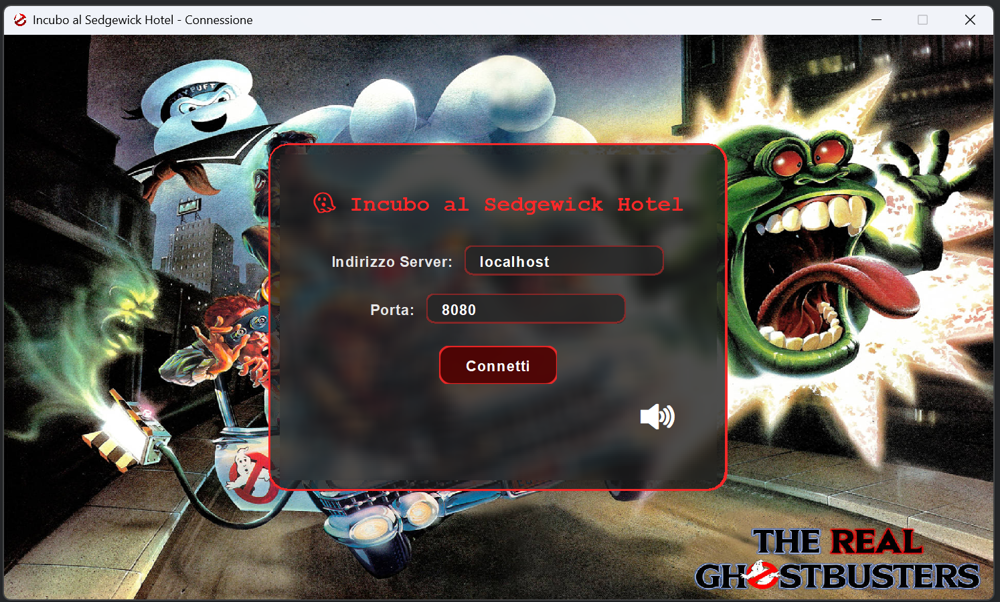

# Soluzione Incubo al Sedgwick Hotel

## Fasi Preliminari

1. `parla con il direttore`
2. `vai a nord`
3. `parla con ospite`
4. `chiama ascensore`
5. `vai nord`
6. `vai a dodicesimo piano`

---

## Primo Inseguimento

7. `usa zaino protonico`
8. `osserva i dintorni`
9. `osserva carrello`
10. `prendi mocio`
11. `inventario`
12. `usa mocio`
13. `vai a est`
14. `vai a sud`
15. `usa rilevatore p.k.e.`
16. `vai a nord`
17. `vai a ovest`  
    `vai a ovest`
18. `vai a sud`
19. `vai a est`  
    `vai a nord`
20. `vai a est`
21. `chiama ascensore`  
    `vai a nord`
22. `vai a piano terra`

---

## Alla Ricerca della Chiave

23. `parla con ospite`
24. `chiama ascensore`  
    `vai a nord`
25. `vai al 12`
26. `vai a ovest`  
    `vai a sud`  
    `vai a est`
27. `usa rilevatore p.k.e.`
28. `vai a ovest`  
    `vai a nord`  
    `vai a est`  
    `vai a sud`  
    `vai a ovest`  
    `vai a nord`
29. `vai a ovest`
30. `osserva`  
    `usa mocio`  
    `raccogli chiave`

---

## Verso la Stanza del Fantasma

31. `vai a est`  
    `vai a est`  
    `vai a sud`
32. `parla con la signora delle pulizie`
33. `usa chiave`
34. `vai a ovest`
35. `parla con la signora delle pulizie`
36. `vai a est`  
    `vai nord`  
    `vai a ovest`  
    `vai a sud`  
    `vai a ovest`  
    `vai a est`  
    `vai a nord`
37. `chiama ascensore`  
    `vai a nord`
38. `vai a piano terra`
39. `vai a sud`  
    `vai a est`

---

## Boss Fight – Sala da Ballo

40. `usa trappola`  
    `usa zaino protonico`  
    `usa trappola`

---

## Note e Suggerimenti

- Puoi sempre digitare `osserva` in qualsiasi stanza per ottenere indizi e dettagli aggiuntivi.
- Puoi sempre digitare `usa rilevatore p.k.e.` per visualizzare la posizione del fantasma in tempo reale.
- Alcuni comandi, come `parla con la signora delle pulizie`, possono avere effetti diversi a seconda del personaggio che interpreti.

---

#### Soluzione scritta da [Aurora Pesare - Gabriele Sanzione - Massimo Ventura]
*Incubo al Sedgwick Hotel*

